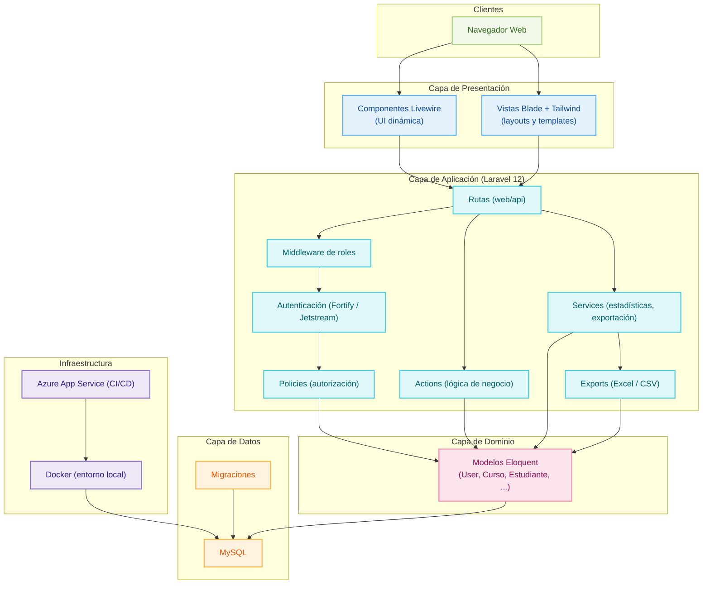

```mermaid

flowchart TD
    %% ====== CLIENTES ======
    subgraph Clientes ["Clientes"]
        browser["Navegador Web"]
    end

    %% ====== PRESENTACIÓN ======
    subgraph Presentacion ["Capa de Presentación"]
        livewire_ui["Componentes Livewire<br>(UI dinámica)"]
        blade_views["Vistas Blade + Tailwind<br>(layouts y templates)"]
    end

    %% ====== APLICACIÓN ======
    subgraph Aplicacion ["Capa de Aplicación (Laravel 12)"]
        routes["Rutas (web/api)"]
        middleware["Middleware de roles"]
        policies["Policies (autorización)"]
        actions["Actions (lógica de negocio)"]
        services["Services (estadísticas, exportación)"]
        exports["Exports (Excel / CSV)"]
        auth["Autenticación (Fortify / Jetstream)"]
    end

    %% ====== DOMINIO ======
    subgraph Dominio ["Capa de Dominio"]
        models["Modelos Eloquent<br>(User, Curso, Estudiante, ...)"]
    end

    %% ====== DATOS ======
    subgraph Datos ["Capa de Datos"]
        db["MySQL"]
        migrations["Migraciones"]
    end

    %% ====== INFRAESTRUCTURA ======
    subgraph Infraestructura ["Infraestructura"]
        docker["Docker (entorno local)"]
        azure["Azure App Service (CI/CD)"]
    end

    %% ====== RELACIONES ======
    browser --> livewire_ui
    browser --> blade_views

    livewire_ui --> routes
    blade_views --> routes

    routes --> middleware
    middleware --> auth
    auth --> policies

    routes --> actions
    routes --> services
    actions --> models
    services --> models
    services --> exports

    policies --> models
    exports --> models

    models --> db
    migrations --> db

    docker --> db
    azure --> docker

    %% ====== ESTILOS PASTEL ======
    classDef clientesStyle fill:#F1F8E9,stroke:#AED581,stroke-width:2px,color:#33691E
    classDef presentacionStyle fill:#E3F2FD,stroke:#64B5F6,stroke-width:2px,color:#0D47A1
    classDef aplicacionStyle fill:#E0F7FA,stroke:#4DD0E1,stroke-width:2px,color:#006064
    classDef dominioStyle fill:#FCE4EC,stroke:#F48FB1,stroke-width:2px,color:#880E4F
    classDef datosStyle fill:#FFF3E0,stroke:#FFB74D,stroke-width:2px,color:#E65100
    classDef infraStyle fill:#EDE7F6,stroke:#9575CD,stroke-width:2px,color:#311B92

    class browser clientesStyle
    class livewire_ui,blade_views presentacionStyle
    class routes,middleware,policies,actions,services,exports,auth aplicacionStyle
    class models dominioStyle
    class db,migrations datosStyle
    class docker,azure infraStyle
```
