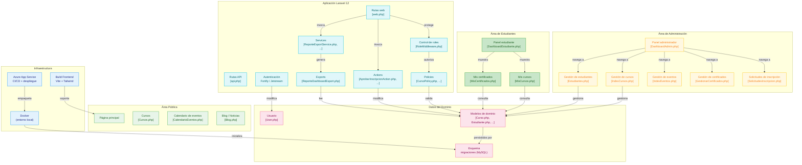

```mermaid

flowchart TD
    subgraph Infraestructura ["Infraestructura"]
        docker["Docker<br>(entorno local)"]
        build["Build Frontend<br>Vite + Tailwind"]
        ci["Azure App Service<br>CI/CD + despliegue"]
    end

    subgraph AreaPublica ["Área Pública"]
        public_home["Página principal"]
        public_cursos["Cursos<br>[Cursos.php]"]
        public_eventos["Calendario de eventos<br>[CalendarioEventos.php]"]
        public_blog["Blog / Noticias<br>[Blog.php]"]
    end

    subgraph AreaEstudiante ["Área de Estudiantes"]
        student_dashboard["Panel estudiante<br>[DashboardEstudiante.php]"]
        student_cursos["Mis cursos<br>[MisCursos.php]"]
        student_certs["Mis certificados<br>[MisCertificados.php]"]
    end

    subgraph AreaAdmin ["Área de Administración"]
        admin_dashboard["Panel administrador<br>[DashboardAdmin.php]"]
        admin_cursos["Gestión de cursos<br>[IndexCursos.php]"]
        admin_estudiantes["Gestión de estudiantes<br>[Estudiantes.php]"]
        admin_eventos["Gestión de eventos<br>[IndexEventos.php]"]
        admin_certificados["Gestión de certificados<br>[GestionarCertificados.php]"]
        admin_solicitudes["Solicitudes de inscripción<br>[SolicitudesInscripcion.php]"]
    end

    subgraph LaravelApp ["Aplicación Laravel 12"]
        web_routes["Rutas web<br>[web.php]"]
        api_routes["Rutas API<br>[api.php]"]
        role_middleware["Control de roles<br>[RoleMiddleware.php]"]
        policies["Policies<br>[CursoPolicy.php, ...]"]
        actions["Actions<br>[AprobarInscripcionAction.php, ...]"]
        services["Services<br>[ReporteExportService.php, ...]"]
        exports["Exports<br>[ReporteDashboardExport.php]"]
        fortify_auth["Autenticación<br>Fortify / Jetstream"]
    end

    subgraph DomainData ["Datos del Dominio"]
        user_model["Usuario<br>[User.php]"]
        domain_models["Modelos de dominio<br>[Curso.php, Estudiante.php, ...]"]
        migrations["Esquema<br>migraciones (MySQL)"]
    end

    %% Conexiones
    web_routes -->|protege| role_middleware
    role_middleware -->|autoriza| policies
    web_routes -->|invoca| actions
    web_routes -->|invoca| services
    services -->|genera| exports

    admin_dashboard -->|navega a| admin_cursos
    admin_dashboard -->|navega a| admin_estudiantes
    admin_dashboard -->|navega a| admin_eventos
    admin_dashboard -->|navega a| admin_certificados
    admin_dashboard -->|navega a| admin_solicitudes

    student_dashboard -->|muestra| student_cursos
    student_dashboard -->|muestra| student_certs

    admin_cursos -->|gestiona| domain_models
    admin_estudiantes -->|gestiona| domain_models
    student_cursos -->|consulta| domain_models
    student_certs -->|consulta| domain_models
    domain_models -->|persistidos por| migrations

    fortify_auth -->|modifica| user_model
    policies -->|valida| domain_models
    actions -->|modifica| domain_models
    exports -->|lee| domain_models

    docker -->|inicializa| migrations
    build -->|soporta| public_home
    ci -->|empaqueta| docker

    %% Estilos pastel
    classDef infraStyle fill:#E3F2FD,stroke:#64B5F6,stroke-width:2px,color:#1A237E
    classDef publicStyle fill:#E8F5E9,stroke:#81C784,stroke-width:2px,color:#1B5E20
    classDef studentStyle fill:#C8E6C9,stroke:#66BB6A,stroke-width:2px,color:#1B5E20
    classDef adminStyle fill:#FFF8E1,stroke:#FFD54F,stroke-width:2px,color:#F57F17
    classDef laravelStyle fill:#E0F7FA,stroke:#4DD0E1,stroke-width:2px,color:#006064
    classDef domainStyle fill:#FCE4EC,stroke:#F48FB1,stroke-width:2px,color:#880E4F

    class docker,build,ci infraStyle
    class public_home,public_cursos,public_eventos,public_blog publicStyle
    class student_dashboard,student_cursos,student_certs studentStyle
    class admin_dashboard,admin_cursos,admin_estudiantes,admin_eventos,admin_certificados,admin_solicitudes adminStyle
    class web_routes,api_routes,role_middleware,policies,actions,services,exports,fortify_auth laravelStyle
    class user_model,domain_models,migrations domainStyle
```
