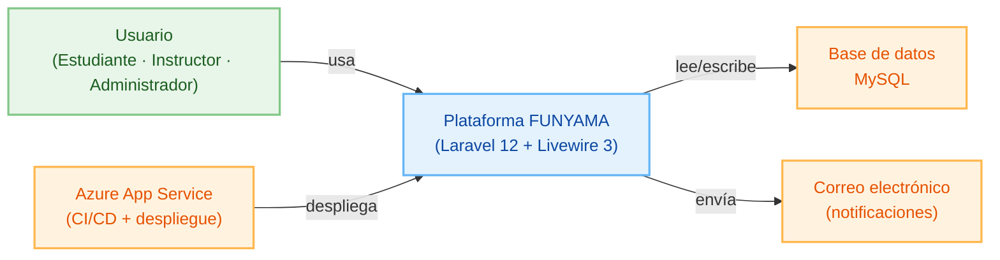

```mermaid

flowchart LR
    user["Usuario<br>(Estudiante · Instructor · Administrador)"]
    system["Plataforma FUNYAMA<br>(Laravel 12 + Livewire 3)"]
    db["Base de datos<br>MySQL"]
    mail["Correo electrónico<br>(notificaciones)"]
    cloud["Azure App Service<br>(CI/CD + despliegue)"]

    user -->|usa| system
    system -->|lee/escribe| db
    system -->|envía| mail
    cloud -->|despliega| system

    %% Estilos
    classDef personStyle fill:#E8F5E9,stroke:#81C784,color:#1B5E20,stroke-width:2px
    classDef systemStyle fill:#E3F2FD,stroke:#64B5F6,color:#0D47A1,stroke-width:2px
    classDef externalStyle fill:#FFF3E0,stroke:#FFB74D,color:#E65100,stroke-width:2px

    class user personStyle
    class system systemStyle
    class db,mail,cloud externalStyle
```
