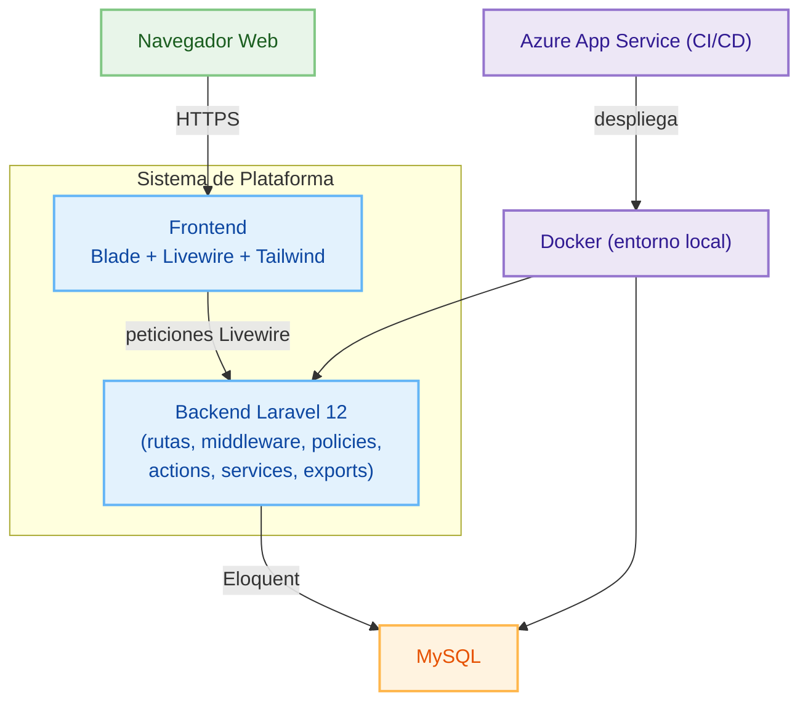

```mermaid

flowchart TD
    %% Clientes
    browser["Navegador Web"]

    %% Contenedores
    subgraph Sistema ["Sistema de Plataforma"]
        frontend["Frontend<br>Blade + Livewire + Tailwind"]
        backend["Backend Laravel 12<br>(rutas, middleware, policies,<br>actions, services, exports)"]
    end

    %% Datos
    db["MySQL"]

    %% Infraestructura
    docker["Docker (entorno local)"]
    azure["Azure App Service (CI/CD)"]

    %% Relaciones
    browser -->|HTTPS| frontend
    frontend -->|peticiones Livewire| backend
    backend -->|Eloquent| db

    docker --> backend
    docker --> db
    azure -->|despliega| docker

    %% Estilos
    classDef clientStyle fill:#E8F5E9,stroke:#81C784,color:#1B5E20,stroke-width:2px
    classDef containerStyle fill:#E3F2FD,stroke:#64B5F6,color:#0D47A1,stroke-width:2px
    classDef dataStyle fill:#FFF3E0,stroke:#FFB74D,color:#E65100,stroke-width:2px
    classDef infraStyle fill:#EDE7F6,stroke:#9575CD,color:#311B92,stroke-width:2px

    class browser clientStyle
    class frontend,backend containerStyle
    class db dataStyle
    class docker,azure infraStyle
```
