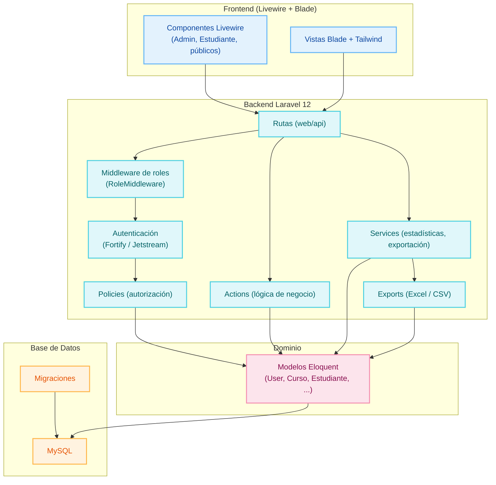

```mermaid

flowchart TD
    %% Frontend
    subgraph Frontend ["Frontend (Livewire + Blade)"]
        livewire["Componentes Livewire<br>(Admin, Estudiante, públicos)"]
        blade["Vistas Blade + Tailwind"]
    end

    %% Backend
    subgraph Backend ["Backend Laravel 12"]
        routes["Rutas (web/api)"]
        middleware["Middleware de roles<br>(RoleMiddleware)"]
        auth["Autenticación<br>(Fortify / Jetstream)"]
        policies["Policies (autorización)"]
        actions["Actions (lógica de negocio)"]
        services["Services (estadísticas, exportación)"]
        exports["Exports (Excel / CSV)"]
    end

    %% Dominio
    subgraph Dominio ["Dominio"]
        models["Modelos Eloquent<br>(User, Curso, Estudiante, ...)"]
    end

    %% Datos
    subgraph Datos ["Base de Datos"]
        db["MySQL"]
        migrations["Migraciones"]
    end

    %% Relaciones
    livewire --> routes
    blade --> routes

    routes --> middleware
    middleware --> auth
    auth --> policies

    routes --> actions
    routes --> services
    actions --> models
    services --> models
    services --> exports

    policies --> models
    exports --> models

    models --> db
    migrations --> db

    %% Estilos pastel profesionales
    classDef frontendStyle fill:#E3F2FD,stroke:#64B5F6,color:#0D47A1,stroke-width:2px
    classDef backendStyle fill:#E0F7FA,stroke:#4DD0E1,color:#006064,stroke-width:2px
    classDef domainStyle fill:#FCE4EC,stroke:#F48FB1,color:#880E4F,stroke-width:2px
    classDef dataStyle fill:#FFF3E0,stroke:#FFB74D,color:#E65100,stroke-width:2px

    class livewire,blade frontendStyle
    class routes,middleware,auth,policies,actions,services,exports backendStyle
    class models domainStyle
    class db,migrations dataStyle
```
